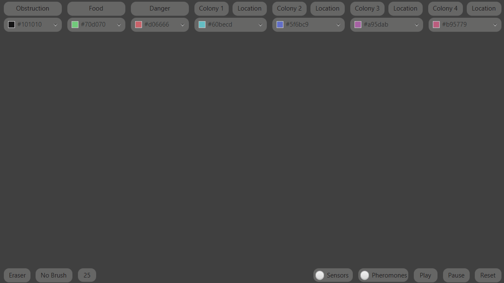

# Ant Colony Simulation
Java based Ant Colony Simulation. Ants follow pheromones to locate food and detect when they are in danger.

## Ant Colony Simulation Features
### Drawing of World
The simulation offers the user the ability to draw their specific simulation world. Adjustable brush size, eraser and no brush settings.

### Start, Stop and Reset
The simulation can be started, stopped and reset at the click of a button.

## Ant Colony Simulation Examples
### Ants Locating Food
[
